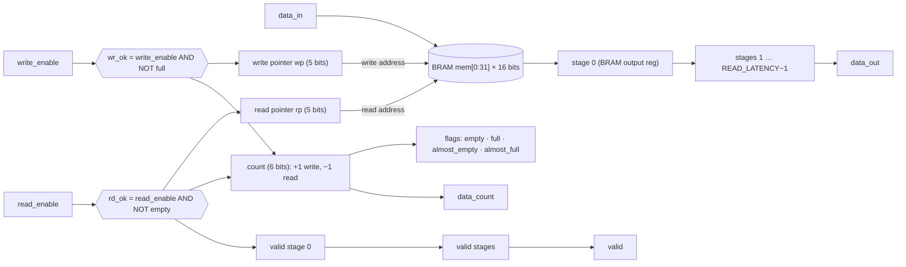

# ECE 520 Lab 3: Single-Clock BRAM FIFO

Andres Riano · ECE 520 · Fall 2026 · Zybo Z7-10 (`xc7z010clg400-1`) · Vivado 2023.2

A parameterized single-clock FIFO in Verilog. Its memory is inferred as **Block RAM** (1 × RAMB18, 0 LUTRAM). It has a configurable **read latency**, and it is checked by a **self-checking testbench**.

## Repository layout

```
src/sc_fifo.v                  FIFO design (top module: sc_fifo)
sim/tb_sc_fifo.v               self-checking testbench (top: tb_sc_fifo)
sim/input_data.txt             test data made by the Python script
scripts/generate_fifo_data.py  writes sim/input_data.txt
scripts/create.tcl             builds the Vivado project in proj/
scripts/simulate.tcl           runs the testbench, copies sim/test_results.txt
README.md
```

## How to run

```
python scripts/generate_fifo_data.py           # 1. make sim/input_data.txt
vivado -mode batch -source scripts/create.tcl   # 2. build the project in proj/
vivado -mode batch -source scripts/simulate.tcl # 3. run the testbench → PASS / FAIL
```
The result is printed in the console and saved to `sim/test_results.txt`.

## Parameters

| Parameter | Default | Meaning |
|---|---|---|
| `WIDTH` | 16 | bits per word |
| `DEPTH` | 32 | number of words (power of 2) |
| `ALMOST_EMPTY_THRESHOLD` | 1 | `almost_empty` = 1 when `data_count` ≤ this |
| `ALMOST_FULL_THRESHOLD` | 31 | `almost_full` = 1 when `data_count` ≥ this |
| `READ_LATENCY` | 1 | clocks from a read request to `data_out`/`valid` (1–8) |

## Ports

| Port | Dir | Width | Description |
|---|---|---|---|
| `clk` | in | 1 | clock (50 MHz in simulation) |
| `srst` | in | 1 | synchronous, active-high reset |
| `write_enable` / `data_in` | in | 1 / WIDTH | write request and data |
| `read_enable` | in | 1 | read request |
| `data_out` / `valid` | out | WIDTH / 1 | read data and its "this data is real" flag |
| `empty`, `full`, `almost_empty`, `almost_full` | out | 1 each | status flags |
| `data_count` | out | `$clog2(DEPTH+1)` = 6 | words currently stored (0–32) |

## How it works

- **Memory:** `reg [WIDTH-1:0] mem [0:DEPTH-1]` with `(* ram_style = "block" *)`. Without the attribute, Vivado maps a 32×16 memory to LUTRAM. With it, synthesis reports **1 × RAMB18**.
- **Pointers:** a write pointer `wp` and a read pointer `rp`, each `$clog2(DEPTH)` = 5 bits. They wrap from 31 back to 0 on their own, which makes the memory a ring.
- **Qualified enables** (from the lecture): `wr_ok = write_enable && !full` and `rd_ok = read_enable && !empty`. A write while full (overflow) or a read while empty (underflow) is ignored.
- **Count:** +1 on write-only, −1 on read-only, unchanged when both happen or neither. Every flag is decoded from `count`.
- **Read latency:** a pipeline of `READ_LATENCY` registers carries the data, and a matching pipeline carries `valid`. Stage 0 is the BRAM output register. `data_out` and `valid` come from the last stage.
- **Reset:** `srst` clears the pointers, the count and the output pipeline, so after reset `empty` = 1 and `data_out`, `valid` and `data_count` = 0.

## Block diagram



## Test cases (sim/tb_sc_fifo.v)

The testbench is **self-checking**. A **scoreboard** records every write the FIFO accepts. Whenever `valid` = 1, it compares `data_out` with the oldest recorded value. Because it waits for `valid`, it works at any read latency. 50 MHz clock (`always #10`), active-high reset.

| Test | What it does | Requirement covered |
|---|---|---|
| TC0 | assert `srst` for 3 clocks; check `data_out`, `valid`, `data_count` = 0, `empty` = 1, `full` = 0 | output returns to 0 after reset |
| TC1 | fill all 32 words with `FFFF`, read all back | all 1s; every memory location |
| TC2 | fill with `0000`, read all back | all 0s; every memory location |
| TC3 | fill with `AAAA`/`5555` alternating, read all back | alternating bit patterns |
| TC4 | fill with `0000`…`001F` (each word unique), read all back | write and read back every location, in order |
| TC1–4 | after each fill: `full`, `almost_full`, `data_count` = 32; a write of `DEAD` while full must be ignored. After each drain: `empty`, `almost_empty`, `data_count` = 0; a read while empty must give no `valid` | all four flags; overflow and underflow; `write_enable` and `read_enable` |
| TC5 | add one word at a time and check `almost_empty`/`almost_full` against their thresholds at every count | almost flags at exact thresholds |
| TC6 | write and read in the same clock; `data_count` must not change | simultaneous read and write |
| end | every accepted write must have come out | nothing lost |

## Results

| READ_LATENCY | ALMOST_EMPTY / ALMOST_FULL | Result |
|---|---|---|
| 1 | 1 / 31 (defaults) | **PASS**, 264 checks, 0 errors |
| 2 | 2 / 30 | **PASS**, 264 checks, 0 errors |
| 3 | 1 / 31 | **PASS**, 264 checks, 0 errors |
| 8 | 2 / 30 | **PASS**, 264 checks, 0 errors |

To test another setting, change the parameters at the top of `sim/tb_sc_fifo.v`.

<!-- WAVEFORM: images/waveform.png goes here -->

## AI use (citation)

Per the ECE 520 syllabus, outside help is cited. **Claude (Anthropic)** was used as a tutor:
- `sc_fifo.v`: typed by me from scaffolds and explanations Claude provided.
- `generate_fifo_data.py`: completed by me from a Claude scaffold (I filled the blanks and fixed the range).
- `tb_sc_fifo.v`: Claude wrote the scaffold; I filled in the key lines (widths, clock, accept condition, `valid` check, loop bounds, flags).
- `create.tcl`, `simulate.tcl` (modeled on the course `multiplier_example`) and this README: drafted by Claude, reviewed by me.
